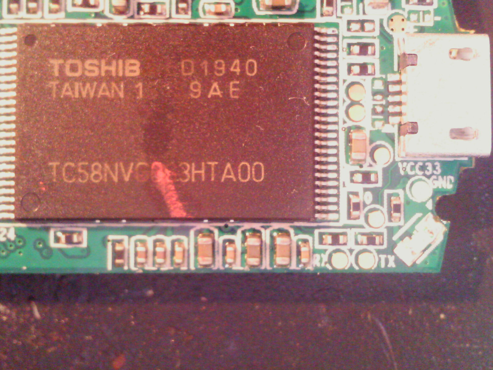

# MiraScreen

It's a /wireless display/ that mimic the ``ChromeCast`` but without
possibility to install applications. [This](https://www.mirascreen.com/prod?p_id=3)
is the product page.

## RLT8188ESU

Use this chip for the WiFi: it's connected via ``USB``

 - [Datasheet](http://www.evselectro.com/image/data/datasheet/RTL8188EUS.pdf)

## AM8252

It's the main processor on this device.

## Download mode

As indicated in this [page](http://www.iezvu.com/download_tool.php?&l=en) it's possible to
activate the flashing mode shorting pins 19 and 20 (right side, bottom to up) each other and then apply power.

After that the device is seen as 

```
Bus 003 Device 010: ID 1de1:1205 Actions Microelectronics Co.
Device Descriptor:
  bLength                18
  bDescriptorType         1
  bcdUSB               2.00
  bDeviceClass            0 (Defined at Interface level)
  bDeviceSubClass         0
  bDeviceProtocol         0
  bMaxPacketSize0        64
  idVendor           0x1de1 Actions Microelectronics Co.
  idProduct          0x1205
  bcdDevice            1.00
  iManufacturer           0
  iProduct                0
  iSerial                 0
  bNumConfigurations      1
  Configuration Descriptor:
    bLength                 9
    bDescriptorType         2
    wTotalLength           32
    bNumInterfaces          1
    bConfigurationValue     1
    iConfiguration          0 
    bmAttributes         0x80
      (Bus Powered)
    MaxPower              300mA
    Interface Descriptor:
      bLength                 9
      bDescriptorType         4
      bInterfaceNumber        0
      bAlternateSetting       0
      bNumEndpoints           2
      bInterfaceClass       255 Vendor Specific Class
      bInterfaceSubClass    255 Vendor Specific Subclass
      bInterfaceProtocol    255 Vendor Specific Protocol
      iInterface              0 
      Endpoint Descriptor:
        bLength                 7
        bDescriptorType         5
        bEndpointAddress     0x01  EP 1 OUT
        bmAttributes            2
          Transfer Type            Bulk
          Synch Type               None
          Usage Type               Data
        wMaxPacketSize     0x0040  1x 64 bytes
        bInterval               0
Device Qualifier (for other device speed):
  bLength                10
  bDescriptorType         6
  bcdUSB               2.00
  bDeviceClass            0 (Defined at Interface level)
  bDeviceSubClass         0
  bDeviceProtocol         0
  bMaxPacketSize0        64
  bNumConfigurations      1
Device Status:     0x0000
  (Bus Powered)
```

same vendor id and product id referenced into the [Forensic analysis of Chromecast and
Miracast devices](https://www.os3.nl/_media/2013-2014/courses/ccf/chromecast-cedric-peter.pdf)

## Serial

It's possible to reach an ``UART`` interface soldering some wires to the two
pads at the bottom of the board (see image below).



## TODO

Write a client application to flash firmware, use this [project](https://github.com/rounaksingh/faltu)
as an example in writing a ``SCSI`` over ``USB`` app.
