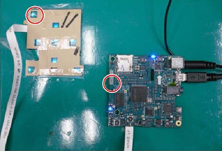

This is the pico projector for Samsung

Product page: http://www.samsung.com/it/support/model/SP0351VBX/EN

This is the ``/var/log/messages`` when attacched

```
Feb 10 15:07:37 pc kernel: [22312.063237] usb 3-9: new high-speed USB device number 4 using xhci_hcd
Feb 10 15:07:53 pc kernel: [22327.372992] usb 3-9: new high-speed USB device number 5 using xhci_hcd
Feb 10 15:07:53 pc kernel: [22327.502208] usb 3-9: New USB device found, idVendor=140e, idProduct=b058
Feb 10 15:07:53 pc kernel: [22327.502211] usb 3-9: New USB device strings: Mfr=1, Product=2, SerialNumber=3
Feb 10 15:07:53 pc kernel: [22327.502212] usb 3-9: Product: File-backed Storage Gadget
Feb 10 15:07:53 pc kernel: [22327.502213] usb 3-9: Manufacturer: TELECHIPS
Feb 10 15:07:53 pc kernel: [22327.502214] usb 3-9: SerialNumber: 0123456789ABCDEF0123456789ABCDEF
Feb 10 15:07:53 pc mtp-probe: checking bus 3, device 5: "/sys/devices/pci0000:00/0000:00:14.0/usb3/3-9"
Feb 10 15:07:53 pc mtp-probe: bus: 3, device: 5 was not an MTP device
Feb 10 15:07:53 pc kernel: [22327.558831] usb-storage 3-9:1.0: USB Mass Storage device detected
Feb 10 15:07:53 pc kernel: [22327.558888] scsi6 : usb-storage 3-9:1.0
Feb 10 15:07:53 pc kernel: [22327.558941] usbcore: registered new interface driver usb-storage
Feb 10 15:07:54 pc kernel: [22328.559490] scsi 6:0:0:0: Direct-Access     TELECHIP MASS STORAGE     03ff PQ: 0 ANSI: 0 CCS
Feb 10 15:07:54 pc kernel: [22328.559739] sd 6:0:0:0: Attached scsi generic sg2 type 0
Feb 10 15:07:54 pc kernel: [22328.560585] sd 6:0:0:0: [sdc] Attached SCSI removable disk
```

```
$ lsusb -v
 ...
Bus 002 Device 010: ID 140e:b058 Telechips, Inc. 
Device Descriptor:
  bLength                18
  bDescriptorType         1
  bcdUSB               2.00
  bDeviceClass            0 (Defined at Interface level)
  bDeviceSubClass         0 
  bDeviceProtocol         0 
  bMaxPacketSize0        64
  idVendor           0x140e Telechips, Inc.
  idProduct          0xb058 
  bcdDevice            3.ff
  iManufacturer           1 TELECHIPS
  iProduct                2 File-backed Storage Gadget
  iSerial                 3 0123456789ABCDEF0123456789ABCDEF
  bNumConfigurations      1
OTG Descriptor:
  bLength                 3
  bDescriptorType         9
  bmAttributes         0x03
    SRP (Session Request Protocol)
    HNP (Host Negotiation Protocol)
  Configuration Descriptor:
    bLength                 9
    bDescriptorType         2
    wTotalLength           35
    bNumInterfaces          1
    bConfigurationValue     1
    iConfiguration          4 Self-powered
    bmAttributes         0xc0
      Self Powered
    MaxPower                2mA
    Interface Descriptor:
      bLength                 9
      bDescriptorType         4
      bInterfaceNumber        0
      bAlternateSetting       0
      bNumEndpoints           2
      bInterfaceClass         8 Mass Storage
      bInterfaceSubClass      6 SCSI
      bInterfaceProtocol     80 Bulk-Only
      iInterface              5 Mass Storage
      Endpoint Descriptor:
        bLength                 7
        bDescriptorType         5
        bEndpointAddress     0x81  EP 1 IN
        bmAttributes            2
          Transfer Type            Bulk
          Synch Type               None
          Usage Type               Data
        wMaxPacketSize     0x0200  1x 512 bytes
        bInterval               0
      Endpoint Descriptor:
        bLength                 7
        bDescriptorType         5
        bEndpointAddress     0x01  EP 1 OUT
        bmAttributes            2
          Transfer Type            Bulk
          Synch Type               None
          Usage Type               Data
        wMaxPacketSize     0x0200  1x 512 bytes
        bInterval               1
 ...
```

```
$ sudo sginfo /dev/sg2
INQUIRY response (cmd: 0x12)
----------------------------
Device Type                        0
Vendor:                    TELECHIP
Product:                   MASS STORAGE
Revision level:            03ff
$ sudo sg_inq /dev/sg2
standard INQUIRY:
  PQual=0  Device_type=0  RMB=1  LU_CONG=0  version=0x00  [no conformance claimed]
  [AERC=0]  [TrmTsk=0]  NormACA=0  HiSUP=0  Resp_data_format=1
  SCCS=0  ACC=0  TPGS=0  3PC=0  Protect=0  [BQue=0]
  EncServ=0  MultiP=0  [MChngr=0]  [ACKREQQ=0]  Addr16=0
  [RelAdr=0]  WBus16=0  Sync=0  [Linked=0]  [TranDis=0]  CmdQue=0
    length=36 (0x24)   Peripheral device type: disk
 Vendor identification: TELECHIP
 Product identification: MASS STORAGE    
 Product revision level: 03ff
```

## Firmware

Seems from the firmware (downloaded from the site) named ``P-OBRNPWWC-1008.1.rom``
that is a ``tar`` archive, that the system is a linux one

```
$ tar -tf Pico\ SP-H03/P-OBRNPWWC-1008.1.rom
./
./wplayer
./opt/
./opt/qt/
./opt/qt/lib/
./opt/qt/lib/libQtNetwork.so.4
./opt/qt/lib/libQtGui.so.4
./opt/qt/lib/fonts/
./opt/qt/lib/fonts/unifont_160_50.qpf
./opt/qt/lib/fonts/Oberon_chn_kor_20091217.ttf
./opt/qt/lib/fonts/langpack_cjk.dat
./opt/qt/lib/libQtCore.so.4
./pico_player
./ui/
  more stuffs
./TCCKernel7.3.rom
./setup/
./setup/reg_set.obn
./opensource/
./opensource/opensource_oberon_dutch.txt
./opensource/opensource_oberon_sweden.txt
./opensource/opensource_oberon_spain.txt
./opensource/opensource_oberon_china.txt
./opensource/opensource_oberon_germany.txt
./opensource/opensource_oberon_turky.txt
./opensource/opensource_oberon_russia.txt
./opensource/opensource_oberon_tai.txt
./opensource/opensource_oberon_portugese.txt
./opensource/opensource_oberon_french.txt
./opensource/opensource_oberon_english.txt
./opensource/opensource_oberon_korea.txt
./opensource/opensource_oberon_italia.txt
./md5sum
./TCCBoot4.2.rom
./run.sh
./pico
```

Analysing the ``TCCKernel7.3.rom`` and ``TCCBoot4.2.rom`` that I assume are respectively the kernel
and bootloader

```
$binwalk Pico\ SP-H03/P-OBRNPWWC-1008.1/TCCBoot4.2.rom 

DECIMAL       HEXADECIMAL     DESCRIPTION
--------------------------------------------------------------------------------

$ binwalk Pico\ SP-H03/P-OBRNPWWC-1008.1/TCCKernel7.3.rom 

DECIMAL       HEXADECIMAL     DESCRIPTION
--------------------------------------------------------------------------------
55177         0xD789          Certificate in DER format (x509 v3), header length: 4, sequence length: 1416
59013         0xE685          Certificate in DER format (x509 v3), header length: 4, sequence length: 13588
78208         0x13180         gzip compressed data, maximum compression, from Unix, last modified: 2010-07-27 01:42:34
4720605       0x4807DD        Certificate in DER format (x509 v3), header length: 4, sequence length: 5376
5024709       0x4CABC5        Certificate in DER format (x509 v3), header length: 4, sequence length: 1328
5419085       0x52B04D        Certificate in DER format (x509 v3), header length: 4, sequence length: 4866
5531093       0x5465D5        Certificate in DER format (x509 v3), header length: 4, sequence length: 1292
5702529       0x570381        Certificate in DER format (x509 v3), header length: 4, sequence length: 13588
6446763       0x625EAB        Linux kernel version 2.6.28
6477872       0x62D830        CRC32 polynomial table, little endian
6821729       0x681761        Unix path: /dev/vc/0
6834593       0x6849A1        IMG0 (VxWorks) header, size: 1111564346
```

looking at the strings inside you can have some clues

```
$ strings Pico\ SP-H03/P-OBRNPWWC-1008.1/TCCBoot4.2.rom | grep -i tele
TELECHIPS01
TELECHIPS02
TELECHIPS03
TELECHIPS04
$ strings Pico\ SP-H03/P-OBRNPWWC-1008.1/TCCBoot4.2.rom | grep -i boot
    tcboot ver %s for %s Linux
tcboot.rom
Updating tcboot.rom -> 
$ strings Pico\ SP-H03/P-OBRNPWWC-1008.1/TCCKernel7.3.rom | grep -i samsung
Samsung Oberon Board
Samsung Info. Systems America, Inc.
Samsung
SAMSUNG
$ strings Pico\ SP-H03/P-OBRNPWWC-1008.1/TCCBoot4.2.rom | grep -i usb
SIGBYAHONG_USB_MANAGER_LINUX_TCC89XX_V2.000
SIGBYAHONG_USBPHY_LINUX_TCC89XX_V2.000
SIGBYAHONG_USB_DEVICE_LINUX_TCC89XX_V2.000
MAX8903A: USB Input.
```

Lurking on github I find [code](https://github.com/JeffreyLau/JJWD-K8_icsCream/blob/a9790f6edf973d9e6b102f9be89c7b7f883f1cb2/bootable/bootloader/lk/platform/tcc_shared/update.c) that
looks like the bootloader code.

## SOC

Seems the ``TCC9101G-0BX`` an [ARM946E-S](processor.https://static.docs.arm.com/ddi0201/d/DDI0201D_arm946es_r1p1_trm.pdf)

https://en.wikipedia.org/wiki/List_of_applications_of_ARM_cores
[ARM1176JZ(F)-S](https://en.wikipedia.org/wiki/ARM11)

## Components

 - Flash [K9G8G08U0A](http://www.image.micros.com.pl/_dane_techniczne_auto/pefnand08g08-025a.pdf)
 - DDR2 SDRAM [K4T1G164](https://4donline.ihs.com/images/VipMasterIC/IC/SAMS/SAMSS11200/SAMSS11200-1.pdf)
 - Battery charger [MAX8903A](https://datasheets.maximintegrated.com/en/ds/MAX8903A.pdf)
 - LCD Flat Panel Processor [TW8816](https://www.deviationtx.com/media/kunena/attachments/1641/TW8816spec_10152007.pdf)
 - Stereo CODEC Cirrus [42L52CNZ](https://pdf1.alldatasheet.com/datasheet-pdf/view/255532/CIRRUS/CS42L52-CNZ.html)

## Connectors

Code | Description | Component
-----|-------------|----------
CN201| Connects to the keypad. A bad connection will disable the keypad. |
CN701| Connects to the AV board. A bad connection will disable the PC, AUDIO and VIDEO inputs. |
CN801| Downloads the sub-MICOM and is for technical service purpose only.|
CN901| Connects to the speaker. A bad connection will disable the audio.|
CN1002| Connects to a fan. A bad connection will disable the fan, causing a fan error. |
CN1003| Connects to a fan. A bad connection will disable the fan, causing a fan error. |
CN1101| Used for debugging, and is for technical service purpose only. | FPC 40 way, .50mm 
CN1102| Connects to the DMD board and main board. A bad connection will cause a blank screen. |


## Boot mode

It's possible to activate two different USB mode to upgrade the system

### Boot ROM

It seems there is a boot mode via USB like described in the datasheet of [TCC760](https://www.bg-electronics.de/datenblaetter/Schaltkreise/TCC760.pdf)
or that other people [have found](https://dreamlayers.blogspot.com/2013/03/telechips-tcc76x-usb-boot.html); it loads via the [tcctool](https://github.com/Rockbox/rockbox/blob/master/utils/tcctool/tcctool.c)
some code in ``SDRAM`` and executes it.

To boot in this mode the SoC checks some GPIOs, namely ``BM[2:0]``, ``GPIOE[3]`` etc... but since I have not
the board layout (yet :P) I don't know where the physical pull-up/pull-down resistor are placed (I supposed
this configuration is done by using resistor); however, in the specification is indicated the boot ROM as the
failsafe when the other configurations fail.

With this in mind I simply shorted the ``CE`` and ``VCC`` of the NAND Flash to obtain the following
USB device

```
Feb 23 10:35:23 turing kernel: [ 1038.755195] usb 2-2: new high-speed USB device number 3 using xhci_hcd
Feb 23 10:35:23 turing kernel: [ 1038.903570] usb 2-2: config 1 interface 0 altsetting 0 bulk endpoint 0x82 has invalid maxpacket 64
Feb 23 10:35:23 turing kernel: [ 1038.903576] usb 2-2: config 1 interface 0 altsetting 0 bulk endpoint 0x1 has invalid maxpacket 64
Feb 23 10:35:23 turing kernel: [ 1038.903582] usb 2-2: New USB device found, idVendor=140e, idProduct=b077
Feb 23 10:35:23 turing kernel: [ 1038.903586] usb 2-2: New USB device strings: Mfr=0, Product=0, SerialNumber=0
Feb 23 10:35:40 turing kernel: [ 1056.322886] usb 2-2: USB disconnect, device number 3
```

```
Bus 002 Device 004: ID 140e:b077 Telechips, Inc.
Device Descriptor:
  bLength                18
  bDescriptorType         1
  bcdUSB               1.10
  bDeviceClass            0 (Defined at Interface level)
  bDeviceSubClass         0
  bDeviceProtocol         0
  bMaxPacketSize0        64
  idVendor           0x140e Telechips, Inc.
  idProduct          0xb077
  bcdDevice            1.00
  iManufacturer           0
  iProduct                0
  iSerial                 0
  bNumConfigurations      1
  Configuration Descriptor:
    bLength                 9
    bDescriptorType         2
    wTotalLength           32
    bNumInterfaces          1
    bConfigurationValue     1
    iConfiguration          0
    bmAttributes         0xc0
      Self Powered
    MaxPower              100mA
    Interface Descriptor:
      bLength                 9
      bDescriptorType         4
      bInterfaceNumber        0
      bAlternateSetting       0
      bNumEndpoints           2
      bInterfaceClass       255 Vendor Specific Class
      bInterfaceSubClass    255 Vendor Specific Subclass
      bInterfaceProtocol    255 Vendor Specific Protocol
      iInterface              0
      Endpoint Descriptor:
        bLength                 7
        bDescriptorType         5
        bEndpointAddress     0x82  EP 2 IN
        bmAttributes            2
          Transfer Type            Bulk
          Synch Type               None
          Usage Type               Data
        wMaxPacketSize     0x0040  1x 64 bytes
        bInterval               0
      Endpoint Descriptor:
        bLength                 7
        bDescriptorType         5
        bEndpointAddress     0x01  EP 1 OUT
        bmAttributes            2
          Transfer Type            Bulk
          Synch Type               None
          Usage Type               Data
        wMaxPacketSize     0x0040  1x 64 bytes
        bInterval               0
Device Status:     0x2300
  (Bus Powered)
```

### FWDN

This is a bootloader mode that allows to upgrade the firmware using special crafted images;
maybe is activated pressing the button nearer the sdcard slot: see the image below



when this happens the device has the red led on and the
usb device has identifier ``140e:b077``(like the ``vid:pid`` used for ``TCC91XX`` [here](https://github.com/JeffreyLau/JJWD-K8_icsCream/blob/a9790f6edf973d9e6b102f9be89c7b7f883f1cb2/bootable/bootloader/lk/platform/tcc_shared/include/usb/usbdev_class.h)). 

## TCCBox

Maybe is possible to use a tool named ``tccbox`` to update the firmware from the command line **of the device**; the source code
maybe is in this [repository](https://github.com/huangguojun/linux_drv/) under ``linux_test/tcc8925_test/firmupdate.c``

## Driver

```
$ file Pico\ SP-H03/vtcdrv/x64/VTC\ Driver\ Installer\ v5.0.0.3\ for\ x64.EXE
Pico SP-H03/vtcdrv/x64/VTC Driver Installer v5.0.0.3 for x64.EXE: PE32 executable (GUI) Intel 80386, for MS Windows, MS CAB-Installer self-extracting archive
$ binwalk Pico\ SP-H03/vtcdrv/x64/VTC\ Driver\ Installer\ v5.0.0.3\ for\ x64.EXE 

DECIMAL       HEXADECIMAL     DESCRIPTION
--------------------------------------------------------------------------------
0             0x0             Microsoft executable, portable (PE)
73228         0x11E0C         PNG image, 256 x 256, 8-bit/color RGBA, non-interlaced
73269         0x11E35         Zlib compressed data, default compression
151900        0x2515C         Microsoft Cabinet archive data, 397310 bytes, 6 files
551644        0x86ADC         XML document, version: "1.0"
551706        0x86B1A         Copyright string: "Copyright (c) Microsoft Corporation -->"
551755        0x86B4B         Copyright string: "Copyright (c) Microsoft Corporation.  All rights reserved."
$ peres -a Pico\ SP-H03/vtcdrv/x64/VTC\ Driver\ Installer\ v5.0.0.3\ for\ x64.EXE
$ find resources/ -type f -print0 | xargs --null file
resources/icons/7.ico:         data
resources/icons/1.ico:         data
resources/icons/12.ico:        data
resources/icons/6.ico:         dBase IV DBT of @.DBF, block length 1024, next free block index 40, next free block 15066613, next used block 15000828
resources/icons/11.ico:        data
resources/icons/5.ico:         data
resources/icons/9.ico:         PNG image data, 256 x 256, 8-bit/color RGBA, non-interlaced
resources/icons/8.ico:         GLS_BINARY_LSB_FIRST
resources/icons/3.ico:         data
resources/icons/10.ico:        data
resources/icons/13.ico:        GLS_BINARY_LSB_FIRST
resources/icons/4.ico:         GLS_BINARY_LSB_FIRST
resources/icons/2.ico:         dBase IV DBT of @.DBF, block length 512, next free block index 40, next free block 2291109880, next used block 28872
resources/manifests/1.xml:     XML 1.0 document, ASCII text, with CRLF line terminators
resources/strings/83.rc:       data
resources/strings/76.rc:       data
resources/strings/63.rc:       data
resources/strings/85.rc:       data
resources/strings/77.rc:       data
resources/strings/80.rc:       data
resources/versions/1.rc:       data
resources/groupicons/3000.ico: data
resources/rcdatas/2486.rc:     ASCII text, with no line terminators
resources/rcdatas/2336.rc:     data
resources/rcdatas/2442.rc:     ASCII text, with no line terminators
resources/rcdatas/2414.rc:     data
resources/rcdatas/2398.rc:     ASCII text, with no line terminators
resources/rcdatas/2530.rc:     ASCII text, with no line terminators
resources/rcdatas/2320.rc:     Microsoft Cabinet archive data, many, 397310 bytes, 6 files, at 0x2c +A "dpinst.exe" +A "dpinst.xml", ID 6404, number 1, 39 datablocks, 0x1503 compression
resources/rcdatas/2542.rc:     ASCII text, with no line terminators
resources/rcdatas/2508.rc:     data
resources/rcdatas/2558.rc:     ASCII text, with no line terminators
resources/rcdatas/2358.rc:     data
resources/rcdatas/2378.rc:     ASCII text, with no line terminators
resources/rcdatas/2304.rc:     ASCII text, with no line terminators
resources/rcdatas/2472.rc:     data
resources/dialogs/2002.dlg:    data
resources/dialogs/2005.dlg:    data
resources/dialogs/2006.dlg:    data
resources/dialogs/2003.dlg:    data
resources/dialogs/2001.dlg:    data
resources/dialogs/2004.dlg:    data
resources/3001.bin:            RIFF (little-endian) data, AVI, 272 x 60, 10.00 fps, video: RLE 8bpp
```

## Links

 - [TCC 92/89xx Android Firmware Upgrade Guide](https://wenku.baidu.com/view/4ae28f1655270722192ef7ec.html)
 - http://www.cnx-software.com/2012/07/18/building-linux-kernel-3-0-8-for-telechips-tcc8925-mini-pcs-cx-01-z900-tizzbird-n1/
 - [DDRAM guide](https://wenku.baidu.com/view/9bf64f6925c52cc58bd6be89.html)
 - [TCC89xx-Android-ALL-1050-V1.07E-Quick Start Guide](https://wenku.baidu.com/view/6545cb13a216147917112879.html) indicates extensively (?) how to use USB boot mode
 - [Guida italiana](https://images-eu.ssl-images-amazon.com/images/G/29/cutulle/BP59-00143A-04Ita._V169094134_.pdf)
 - [Source code](http://www.pudn.com/Download/item/id/1269408.html) of the (probable) bootloader named ``tcboot``.
 - ``f21b0242eac7f91090eaa949c699d2bc9252ca85`` is the hash of the torrent containing a lot of leaked materials about this family of chips
 - https://www.rockbox.org/wiki/TelechipsInfo
 - https://downloadcustomromandroid.blogspot.com/2014/02/download-telechips-fwdn-v7-v222.html
 - https://github.com/cnxsoft/tccutils/
 - https://wenku.baidu.com/view/6545cb13a216147917112879.html
 - https://wenku.baidu.com/view/4ae28f1655270722192ef7ec.html
 - [TCC8900 FWDN for Linux](https://www.tripleoxygen.net/post/tcc8900-fwdn-for-linux/)
