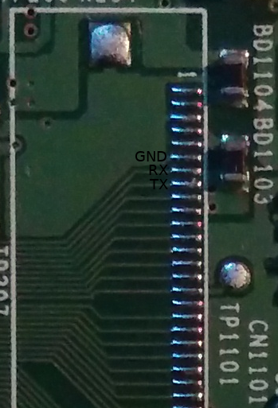

This is the pico projector for Samsung

Product page: http://www.samsung.com/it/support/model/SP0351VBX/EN

## Analysis

 - [boot log](boot.md)
 - [USB](usb.md)
 - [firmware files](firmware.md)
 - [bootloader reversing](bootloader.md)
 - [GPIOs recovery](gpios.md)
 - [Windows driver for FWDN7](windows_driver.md)

## SOC

Seems the ``TCC9101G-0BX``, an [ARM1176JZ(F)-S](https://en.wikipedia.org/wiki/ARM11)
used also for the Cowon v5 tablet.

See the [list of the ARM cores](https://en.wikipedia.org/wiki/List_of_applications_of_ARM_cores).

## Components

 - Flash [K9G8G08U0A](http://www.image.micros.com.pl/_dane_techniczne_auto/pefnand08g08-025a.pdf)
 - DDR2 SDRAM [K4T1G164](https://4donline.ihs.com/images/VipMasterIC/IC/SAMS/SAMSS11200/SAMSS11200-1.pdf)
 - Battery charger [MAX8903A](https://datasheets.maximintegrated.com/en/ds/MAX8903A.pdf)
 - LCD Flat Panel Processor [TW8816](https://www.deviationtx.com/media/kunena/attachments/1641/TW8816spec_10152007.pdf)
 - Stereo CODEC Cirrus [42L52CNZ](https://pdf1.alldatasheet.com/datasheet-pdf/view/255532/CIRRUS/CS42L52-CNZ.html)

## Connectors

Code | Description | Component
-----|-------------|----------
CN201| Connects to the keypad. A bad connection will disable the keypad. |
CN701| Connects to the AV board. A bad connection will disable the PC, AUDIO and VIDEO inputs. |
CN801| Downloads the sub-MICOM and is for technical service purpose only.|
CN901| Connects to the speaker. A bad connection will disable the audio.|
CN1002| Connects to a fan. A bad connection will disable the fan, causing a fan error. |
CN1003| Connects to a fan. A bad connection will disable the fan, causing a fan error. |
CN1101| Used for debugging, and is for technical service purpose only. | FPC 40 way, .50mm 
CN1102| Connects to the DMD board and main board. A bad connection will cause a blank screen. |

### Serial

It's located in the connector ``CN1101`` with pin 6, 7, 8 as indicated in picture

## TCCBox

Maybe is possible to use a tool named ``tccbox`` to update the firmware from the command line **of the device**; the source code
maybe is in this [repository](https://github.com/huangguojun/linux_drv/) under ``linux_test/tcc8925_test/firmupdate.c``

## Links

 - [TCC 92/89xx Android Firmware Upgrade Guide](https://wenku.baidu.com/view/4ae28f1655270722192ef7ec.html)
 - http://www.cnx-software.com/2012/07/18/building-linux-kernel-3-0-8-for-telechips-tcc8925-mini-pcs-cx-01-z900-tizzbird-n1/
 - [DDRAM guide](https://wenku.baidu.com/view/9bf64f6925c52cc58bd6be89.html)
 - [TCC89xx-Android-ALL-1050-V1.07E-Quick Start Guide](https://wenku.baidu.com/view/6545cb13a216147917112879.html) indicates extensively (?) how to use USB boot mode
 - [Guida italiana](https://images-eu.ssl-images-amazon.com/images/G/29/cutulle/BP59-00143A-04Ita._V169094134_.pdf)
 - [Source code](http://www.pudn.com/Download/item/id/1269408.html) of the (probable) bootloader named ``tcboot``.
 - ``f21b0242eac7f91090eaa949c699d2bc9252ca85`` is the hash of the torrent containing a lot of leaked materials about this family of chips
 - https://www.rockbox.org/wiki/TelechipsInfo
 - https://downloadcustomromandroid.blogspot.com/2014/02/download-telechips-fwdn-v7-v222.html
 - https://github.com/cnxsoft/tccutils/
 - https://wenku.baidu.com/view/6545cb13a216147917112879.html
 - https://wenku.baidu.com/view/4ae28f1655270722192ef7ec.html
 - [TCC8900 FWDN for Linux](https://www.tripleoxygen.net/post/tcc8900-fwdn-for-linux/)
