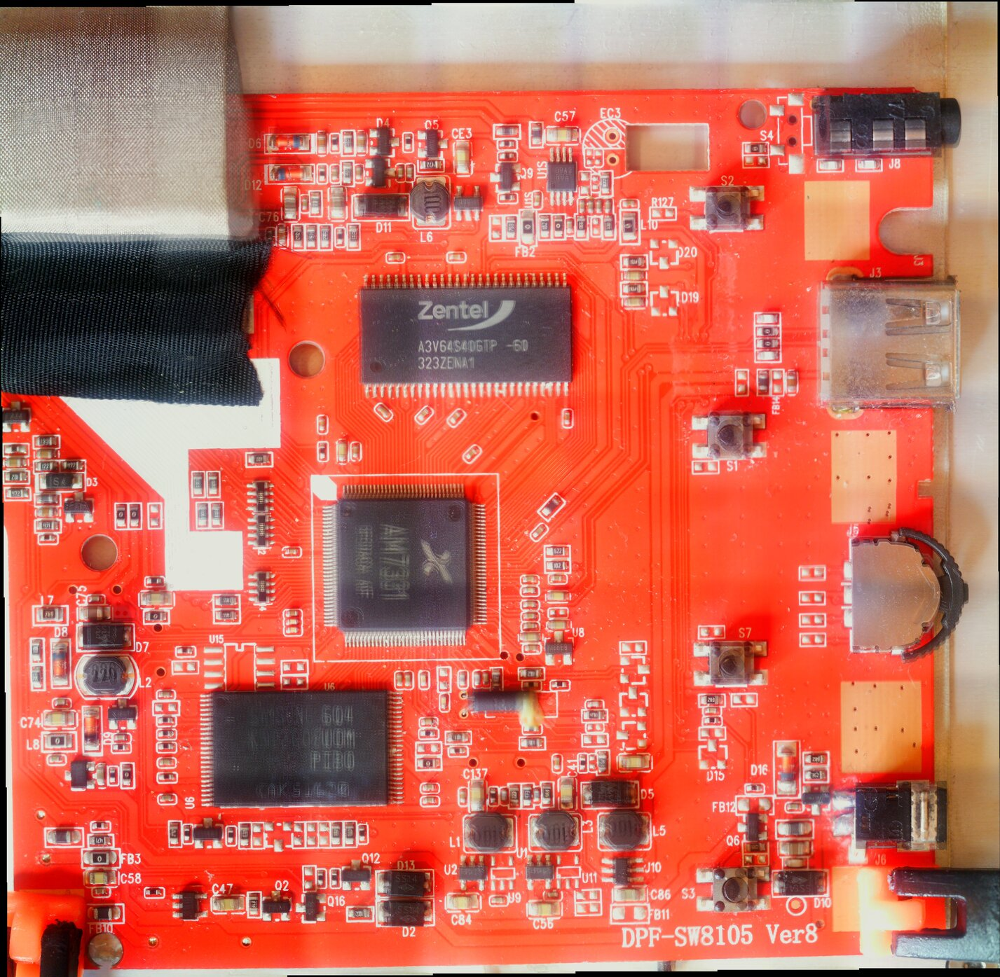

# Michelin

I named this after the brand on it.



https://4pda.ru/forum/index.php?showtopic=708093&st=3080

https://www.transcend-info.com/Support/No-311

## Processor

It's an infamous ``AM7331`` related to **Actions Microelectronics**, like
the MiraScreen.

It seems that the Philips SPF4080P photo frame has the same SoC.

https://fccid.io/YL5SPF4080P/Label/Label-Sample-1341109

## Flash

K9F2G08U0M

## Bootlog

There is a pad on the back with a ``TX`` label on the side and if you
connect a serial at 115200 baud you obtain the following
messages on power up:

```
***AL1203, AM12030002,brec.bin Ver  svn7663 Dec 22 2014 ,Flash:2***

MU_REG1 0xb01c0080,0x2600
MU_REG2 0xb01c0090,0x0

======== Flash Init hardware==========
CMU_COREPLL: 86a90df
CMU_BUSCLK :     390
SDR_CTL:   f0120
SDR_INIT :c0000014
SDR_TIMING : c92814a
SDR_AUTORFC      4fc
SDR_EN:       1
SDR_MODE :      32
SDR_PD: 2625a00
SDR_INITD:    cf08
***end3,4,27500 Khz,48901****


## boot  Flash ID:0x1580daec#
ECC BCH8 
ecctl:0x1 

RECLAIM_VAL:6 bitECC,set:6 bit
###6,4,330Mhz,15MHz,15714Khz ###
###6,4,48900###

#PHY_TMPBUF(NandDevInfo.PhyCache):0xa00c0010 
#GPageBuf:0xa00c0a20 NandDevInfo.TestCache:0xa00c1a30,logical Page:4
ScanSearchZoneTbls: [SCAN] Found valid zone table 0 for die 0 at block 8, page 8.
ScanSearchZoneTbls: [SCAN] Found valid zone table 0 for die 1 at block 8, page 8.

===NO:    0,Read Zone : 0, Blk:8,Pge:8===
###CodeSize:4300,1 ###
##1. Reclaim: BCH 6,6 ##brecsize:128 4000
##2. Super:1, Readclaim:1
##3. Super:0, Wearleveling:0
##4.ECC_reclaim,1,overecc:0
##5.DataBlk:984,MultiPlane:0
##6.PageCache:0xa00c0010,4
##7.NandDevInfo.PhyCache:0xa00c1020:
FlashBuf:a00c2990,:a00c2ba0
FlashBuf_S:a00c2db0,D:a00c3dc0

+++1> SystemSize:4300, 1:4300,2:20,3:4300,4:0, 5:0,6:0,7:6e6e0 +++


#get file :0,res:1#
file:nand:EASY    BIN
get file filenum:3,result:0xxx
rd
ENter BY GPIO  255
ret = 0
system_code_check end 883ms
system_code_check retrun 0
###MBRC_Whole:3, code:2,55aa2d66!####
### Read 55aa2d66,55aa2d66,3
### Read 55aa2d66,55aa2d66,3
### Read 55aa2d66,55aa2d66,3
mbrc_test_repair OK
brec_test_repair OK
 mmu_num_mods: 0x7f00000
 mmu_min_virt_addr: 0x100000
 mmu_region_phy_addr: 0x54000
 mmu_region_size: 0xc0000
 vma_flash_drv_start: 0x80014ce0
 vma_flash_drv_end: 0xcdc0
 sys_heap_start: 0x80021aa0
 sys_heap_size: 0x32560
 mmm_heap_start: 0x80054000
 mmm_heap_size: 0x0
SD_KINIT_BIN
SDRAMLoadAddr =0xa01c1000
BREC#kinit.bin is loaded at a01c0000
BREC#syscfg.sys is loaded at a0000000
BREC#nand648.drv is loaded at a0014ce0
./../../../nand_driver_entry.cBrec nand exit!! 
Starting Kernel at 0x801c0000
fb_drv.c 1284 BL_CTL=[0x8201e853]
global_data.show_backlight:0
act_setUsbStat:stat=0
FSerr[FS__fat_FindFilePath]:dname_start == NULL 

FSinf[FS_Fat_OpenDir]:747 ,cd = 1

check U16     BIN:
check U24     BIN:
check U32     BIN:
CheckOver
FSinf[FS_Fat_OpenDir]:747 ,cd = 1

FSerr[FS__fat_FindFilePath]:dname_start == NULL 

FSerr[FS__fat_FindFilePath]:dname_start == NULL 

FSerr[FS__fat_FindFilePath]:dname_start == NULL 

FSinf[FS_Fat_OpenDir]:747 ,cd = 1

head_temp->figure:1,head_temp->format:.MP4
the 0 num head_array name is C:\0\1.MP4
FSinf[FS_Fat_OpenDir]:747 ,cd = 1

FSinf[FS_Fat_OpenDir]:747 ,cd = 1

FSinf[FS_Fat_OpenDir]:747 ,cd = 1

init_meap(80200000,100000)
!!!!1203act_dac_init
line:891,video_name:C:\0\1.MP4
MMM_VIDEO: load_plugin(avd_mov.lib)

===NO:    1,Read Zone : 1, Blk:8,Pge:8===
video type 13
support
MMM_VIDEO: load_plugin(ad_audio.lib)
MMM_VIDEO: load_plugin(vd_xvid.lib)
here
dpb_num:[4],ow[800],oh[480],fmt[3],reload[1],lvds[0]
dpb, start video, init_flg=1
open speaker 
reset da module
GetGPIO(30):0
adc_key is d,global_data.open_show_bat:1
osd_api.c 701 x+w =[842]
[O_O]check your low crystal!
GetGPIO(30):0
adc_key is d,global_data.open_show_bat:2
osd_api.c 701 x+w =[842]
set standby_enable
GetGPIO(30):0
adc_key is d,global_data.open_show_bat:3
osd_api.c 701 x+w =[842]
GetGPIO(30):0
```


It's present a USB connector on the side, if you insert a USB key and
press the first button from the top at power up you obtain the following log:

```
***AL1203, AM12030002,brec.bin Ver  svn7663 Dec 22 2014 ,Flash:2***

MU_REG1 0xb01c0080,0x2600
MU_REG2 0xb01c0090,0x0

======== Flash Init hardware==========
CMU_COREPLL: 86a90df
CMU_BUSCLK :     390
SDR_CTL:   f0120
SDR_INIT :c0000014
SDR_TIMING : c92814a
SDR_AUTORFC      4fc
SDR_EN:       1
SDR_MODE :      32
SDR_PD: 2625a00
SDR_INITD:    cf08
***end3,4,27500 Khz,48901****


## boot  Flash ID:0x1580daec#
ECC BCH8 
ecctl:0x1 

RECLAIM_VAL:6 bitECC,set:6 bit
###6,4,330Mhz,15MHz,15714Khz ###
###6,4,48900###

#PHY_TMPBUF(NandDevInfo.PhyCache):0xa00c0010 
#GPageBuf:0xa00c0a20 NandDevInfo.TestCache:0xa00c1a30,logical Page:4
ScanSearchZoneTbls: [SCAN] Found valid zone table 0 for die 0 at block 8, page 20.
ScanSearchZoneTbls: [SCAN] Found valid zone table 0 for die 1 at block 8, page 8.

===NO:    0,Read Zone : 0, Blk:8,Pge:20===
###CodeSize:4300,1 ###
##1. Reclaim: BCH 6,6 ##brecsize:128 4000
##2. Super:1, Readclaim:1
##3. Super:0, Wearleveling:0
##4.ECC_reclaim,1,overecc:0
##5.DataBlk:984,MultiPlane:0
##6.PageCache:0xa00c0010,4
##7.NandDevInfo.PhyCache:0xa00c1020:
FlashBuf:a00c2990,:a00c2ba0
FlashBuf_S:a00c2db0,D:a00c3dc0

+++1> SystemSize:4300, 1:4300,2:20,3:4300,4:0, 5:0,6:0,7:6e6e0 +++


#get file :0,res:1#
file:nand:EASY    BIN
get file filenum:3,result:0xxx
rd
ENter BY GPIO  255
ret = 0
system_code_check end 883ms
system_code_check retrun 0
###MBRC_Whole:3, code:2,55aa2d66!####
### Read 55aa2d66,55aa2d66,3
### Read 55aa2d66,55aa2d66,3
### Read 55aa2d66,55aa2d66,3
mbrc_test_repair OK
brec_test_repair OK
 mmu_num_mods: 0x7f00000
 mmu_min_virt_addr: 0x100000
 mmu_region_phy_addr: 0x54000
 mmu_region_size: 0xc0000
 vma_flash_drv_start: 0x80014ce0
 vma_flash_drv_end: 0xcdc0
 sys_heap_start: 0x80021aa0
 sys_heap_size: 0x32560
 mmm_heap_start: 0x80054000
 mmm_heap_size: 0x0
SD_KINIT_BIN
SDRAMLoadAddr =0xa01c1000
BREC#kinit.bin is loaded at a01c0000
BREC#syscfg.sys is loaded at a0000000
BREC#nand648.drv is loaded at a0014ce0
./../../../nand_driver_entry.cBrec nand exit!! 
Starting Kernel at 0x801c0000
fb_drv.c 1284 BL_CTL=[0x8201e853]
global_data.show_backlight:0
fb_drv.c 1284 BL_CTL=[0x82030933]
send KEY_LONG,k=8
check U16     BIN:
check U24     BIN:
check U32     BIN:
CheckOver
[O_O]check your low crystal!
set standby_enable
enter a_fsm
a_plug_process:902
act_setUsbStat:stat=0
plug:4033

[Kernel]task[22],stack=[c6ffc:c6000]
act_setUsbStat:stat=0
set_vbus_detect_threshold:old val-c00
set_vbus_detect_threshold:set val-c10
set_vbus_detect_threshold:new val-c10
AI:state from 00 ->00
AOTG uoc driver probe successfully

[Kernel]task[1],stack=[d0ffc:d0000]
debounce:total 120ms stable 120ms status 0x101
usb_alloc_dev:sem a
__hotplug_event:msg=11

[Kernel]task[10],stack=[e0ffc:e0000]
FSinf[FS_Dev_Register]:907 ,FS_Dev_Register dev:00917294

ep->maxp=512
ep->maxp=512
test-disk: Write Protect is off
test-disk: Mode Sense: 45 00 00 08
__hotplug_event:msg=88
FSinf[FS_Os_ParseDev]:268 ,FS Has MBR.

FSinf[FS_Os_ParseMbr]:652 ,DBR addr toobig(2048)
FSinf[FS_Os_ParseBpb]:395 ,FS dev:0x10100000

FSinf[FS_Os_ParseBpb]:461 ,FS Clustsize:4096 BytePerSec:512 SecPerClust:8 perSec:1

FSinf[FS_Os_ParseBpb]:539 ,FS FAT32 
FSinf[FS_Os_ParseBpb]:541 ,TotalClust:979843

Start checking upgrade firmware version......
FSerr[FS_Fat_act_OpenFile]:n:
ACTUPGRADE.BIN
41 43 54 55 50 47 52 41 44 45 2e 42 49 4e 00 
Open D:\ACTUPGRADE.BIN , file pointer = 0x0
card install errorFSerr[FS__fat_FindFilePath]:dname_start == NULL 


ilePath]:FSinf[FS_Fat_OpenDir]:747 ,cd = 0

FSerr[FS_Fat_OpenDir]:cdchild n:
D:\0\
FSinf[FS_OpenDir]:597 ,FS_Fat_OpenDir err 

d_OpenDir err 

FSerr[FS__fat_FindFilePath]:dname_start == NULL 

FSerr[FS__fat_FindFilePath]:dname_start == NULL 

FSinf[FS_Fat_OpenDir]:747 ,cd = 0

FSerr[FS_Fat_OpenDir]:cdchild n:
D:\1\
FSinf[FS_OpenDir]:597 ,FS_Fat_OpenDir err 

FSerr[FS__fat_FindFilePath]:dname_start == NULL 

FSerr[FS__fat_FindFilePath]:dname_start == NULL 

FSinf[FS_Fat_OpenDir]:747 ,cd = 0

FSerr[FS_Fat_OpenDir]:cdchild n:
D:\2\
FSinf[FS_OpenDir]:597 ,FS_Fat_OpenDir err 

FSerr[FS__fat_FindFilePath]:dname_start == NULL 

FSerr[FS__fat_FindFilePath]:dname_start == NULL 

FSinf[FS_Fat_OpenDir]:747 ,cd = 0

FSerr[FS_Fat_OpenDir]:cdchild n:
D:\3\
FSinf[FS_OpenDir]:597 ,FS_Fat_OpenDir err 

FSerr[FS__fat_FindFilePath]:dname_start == NULL 

FSerr[FS__fat_FindFilePath]:dname_start == NULL 

FSinf[FS_Fat_OpenDir]:747 ,cd = 0

FSerr[FS_Fat_OpenDir]:cdchild n:
D:\4\
FSinf[FS_OpenDir]:597 ,FS_Fat_OpenDir err 

FSerr[FS__fat_FindFilePath]:dname_start == NULL 

width_bar:0
FSinf[FS_Fat_OpenDir]:747 ,cd = 0

FSerr[FS_Fat_OpenDir]:cdchild n:
D:\0\
FSinf[FS_OpenDir]:597 ,FS_Fat_OpenDir err 

FSinf[FS_Fat_OpenDir]:747 ,cd = 0

FSerr[FS_Fat_OpenDir]:cdchild n:
D:\1\
FSinf[FS_OpenDir]:597 ,FS_Fat_OpenDir err 

FSinf[FS_Fat_OpenDir]:747 ,cd = 0

FSerr[FS_Fat_OpenDir]:cdchild n:
D:\2\
FSinf[FS_OpenDir]:597 ,FS_Fat_OpenDir err 

FSinf[FS_Fat_OpenDir]:747 ,cd = 0

FSerr[FS_Fat_OpenDir]:cdchild n:
D:\3\
FSinf[FS_OpenDir]:597 ,FS_Fat_OpenDir err 

FSinf[FS_Fat_OpenDir]:747 ,cd = 0

FSerr[FS_Fat_OpenDir]:cdchild n:
D:\4\
FSinf[FS_OpenDir]:597 ,FS_Fat_OpenDir err 

FSerr[FS__fat_FindFilePath]:dname_start == NULL 

FSinf[FS_Fat_OpenDir]:747 ,cd = 0

FSerr[FS_Fat_OpenDir]:cdchild n:
D:\0\
FSinf[FS_OpenDir]:597 ,FS_Fat_OpenDir err 

FSerr[FS__fat_FindFilePath]:dname_start == NULL 

FSerr[FS__fat_FindFilePath]:dname_start == NULL 

FSinf[FS_Fat_OpenDir]:747 ,cd = 0

FSerr[FS_Fat_OpenDir]:cdchild n:
D:\1\
FSinf[FS_OpenDir]:597 ,FS_Fat_OpenDir err 

FSerr[FS__fat_FindFilePath]:dname_start == NULL 

FSerr[FS__fat_FindFilePath]:dname_start == NULL 

FSinf[FS_Fat_OpenDir]:747 ,cd = 0

FSerr[FS_Fat_OpenDir]:cdchild n:
D:\2\
FSinf[FS_OpenDir]:597 ,FS_Fat_OpenDir err 

FSerr[FS__fat_FindFilePath]:dname_start == NULL 

FSerr[FS__fat_FindFilePath]:dname_start == NULL 

FSinf[FS_Fat_OpenDir]:747 ,cd = 0

FSerr[FS_Fat_OpenDir]:cdchild n:
D:\3\
FSinf[FS_OpenDir]:597 ,FS_Fat_OpenDir err 

FSerr[FS__fat_FindFilePath]:dname_start == NULL 

FSerr[FS__fat_FindFilePath]:dname_start == NULL 

FSinf[FS_Fat_OpenDir]:747 ,cd = 0

FSerr[FS_Fat_OpenDir]:cdchild n:
D:\4\
FSinf[FS_OpenDir]:597 ,FS_Fat_OpenDir err 

FSerr[FS__fat_FindFilePath]:dname_start == NULL 

width_bar:0
fb_drv.c 1284 BL_CTL=[0x82030853]
act_setUsbStat:stat=0
FSerr[FS__fat_FindFilePath]:dname_start == NULL 

FSinf[FS_Fat_OpenDir]:747 ,cd = 1

FSinf[FS_Fat_OpenDir]:747 ,cd = 1

FSerr[FS__fat_FindFilePath]:dname_start == NULL 

FSerr[FS__fat_FindFilePath]:dname_start == NULL 

FSerr[FS__fat_FindFilePath]:dname_start == NULL 

FSinf[FS_Fat_OpenDir]:747 ,cd = 1

head_temp->figure:1,head_temp->format:.MP4
the 0 num head_array name is C:\0\1.MP4
msg.msg.data[0]:88
msg.msg.data[0]:c8
msg.msg.data[0]:c8
msg.msg.data[0]:c8
msg.msg.data[0]:c8
msg.msg.data[0]:c8
msg.msg.data[0]:c8
msg.msg.data[0]:c8
msg.msg.data[0]:c8
msg.msg.data[0]:c8
msg.msg.data[0]:c8
msg.msg.data[0]:c8
msg.msg.data[0]:c8
msg.msg.data[0]:c8
msg.msg.data[0]:c8
msg.msg.data[0]:c8
msg.msg.data[0]:c8
msg.msg.data[0]:c8
msg.msg.data[0]:c8
msg.msg.data[0]:c8
msg.msg.data[0]:c8
FSinf[FS_Fat_OpenDir]:747 ,cd = 1

msg.msg.data[0]:c8
msg.msg.data[0]:c8
FSinf[FS_Fat_OpenDir]:747 ,cd = 1

FSinf[FS_Fat_OpenDir]:747 ,cd = 1

init_meap(80200000,100000)
!!!!1203act_dac_init
line:891,video_name:C:\0\1.MP4
MMM_VIDEO: load_plugin(avd_mov.lib)

===NO:    1,Read Zone : 1, Blk:8,Pge:8===
video type 13
support
MMM_VIDEO: load_plugin(ad_audio.lib)
MMM_VIDEO: load_plugin(vd_xvid.lib)
here
dpb_num:[4],ow[800],oh[480],fmt[3],reload[1],lvds[0]
dpb, start video, init_flg=1
open speaker 
reset da module
msg.msg.data[0]:c8
msg.msg.data[0]:c8
msg.msg.data[0]:c8
msg.msg.data[0]:c8
GetGPIO(30):0

```

## ADFU mode

It's possible to enter ``ADFU`` mode shorting the ``!CE`` pin
of the flash with 3.3V

https://web.archive.org/web/20080327212622/http://www.s1mp3.org/en/docs_deadrec.php

https://wenku.baidu.com/view/543c8b4d852458fb770b56ee.html

```
kernel: [1217438.375421] usb 2-6: new high-speed USB device number 49 using xhci_hcd
kernel: [1217438.907401] usb 2-6: new full-speed USB device number 50 using xhci_hcd
kernel: [1217438.927629] usb 2-6: not running at top speed; connect to a high speed hub
kernel: [1217438.927799] usb 2-6: New USB device found, idVendor=1de1, idProduct=1205, bcdDevice= 1.00
kernel: [1217438.927801] usb 2-6: New USB device strings: Mfr=0, Product=0, SerialNumber=0
mtp-probe: checking bus 2, device 50: "/sys/devices/pci0000:00/0000:00:14.0/usb2/2-6"
mtp-probe: bus: 2, device: 50 was not an MTP device
mtp-probe: checking bus 2, device 50: "/sys/devices/pci0000:00/0000:00:14.0/usb2/2-6"
mtp-probe: bus: 2, device: 50 was not an MTP device
```

## Fuzzing

## HWSC

```

INIT_HWSC:****hwsc.bin Ver  svn7663 Jul  5 2012 ,hard_ware_scan_main****


 +++++:nand_flash_inithw_HWSC,run to:429+++++++
GPIO_MFCTL1:b01c0044,0x10000000
GPIO_MFCTL2:b01c0048,0x31011111
GPIO_MFCTL3:b01c004c,0xc0156233
GPIO_MFCTL4:b01c0050,0x0
CMU_COREPLL 0xb0010000:0x86a90dd
CMU_BUSCLK 0xb001000c:0x390
SDR_CLKDLY_VAL 0xB0070024:0xc0000014
SDR_CTL 0xB0070000:0xf0120
SDR_INIT 0xB0070028:0xcf08
SDR_TIMING 0xB0070030:0xc92814a
SDR_AUTORFC 0xB0070014:0x 4fc
SDR_EN 0xB0070008:0x1
SDR_MODE 0xB0070018:0x32
SDR_PD 0xB0070034:0x4c4b400
SDR_INITD 0xB0070028:0xcf08

MU_REG1 0xB01C0080,0x0
MU_REG2 0xB01C0090,0x0

PMU_DHVLDO_VAL 0xB0000000 + 0x14,0x0
PMU_DLVLDO_VAL 0xB0000000 + 0x18,0x0

====1.1580daec,ec,da,80,15,======
====2.80daec50,50,ec,da,80,======
run to:_SearchIdTable2,1
_SearchIdTable2 :1
Page Size is:4
Block Sizeis:64
NAND Flash  is:1580daec
*TmpSecPerBlk:8,4 KB
CMD92       is:0
hard_ware_scan_main  38343646

INIT_HWSC:****hwsc.bin Ver  svn7663 Jul  5 2012 ,hard_ware_scan_main****


 +++++:nand_flash_inithw_HWSC,run to:429+++++++
GPIO_MFCTL1:b01c0044,0x10000000
GPIO_MFCTL2:b01c0048,0x31011111
GPIO_MFCTL3:b01c004c,0xc0156233
GPIO_MFCTL4:b01c0050,0x0
CMU_COREPLL 0xb0010000:0x86a90dd
CMU_BUSCLK 0xb001000c:0x390
SDR_CLKDLY_VAL 0xB0070024:0xc0000014
SDR_CTL 0xB0070000:0xf0120
SDR_INIT 0xB0070028:0xcf08
SDR_TIMING 0xB0070030:0xc92814a
SDR_AUTORFC 0xB0070014:0x 4fc
SDR_EN 0xB0070008:0x1
SDR_MODE 0xB0070018:0x32
SDR_PD 0xB0070034:0x4c4b400
SDR_INITD 0xB0070028:0xcf08

MU_REG1 0xB01C0080,0x0
MU_REG2 0xB01C0090,0x0

PMU_DHVLDO_VAL 0xB0000000 + 0x14,0x0
PMU_DLVLDO_VAL 0xB0000000 + 0x18,0x0

====1.1580daec,ec,da,80,15,======
====2.80daec50,50,ec,da,80,======
run to:_SearchIdTable2,1
_SearchIdTable2 :1
Page Size is:4
Block Sizeis:64
NAND Flash  is:1580daec
*TmpSecPerBlk:8,4 KB
CMD92       is:0
hard_ware_scan

```

## FWSC

```
[INIT] INIT_CreateBlkTbls() enter.
Flash ChipNo:0 CHIPID:1580daec
Flash ChipNo:1 CHIPID:0
###6,4,330Mhz,15MHz,15714Khz ###
###6,4,48900###

INIT_DBG: ================NAND STORAGE INFOR================
INIT_DBG:     ChipEnableInfo is:0x1
INIT_DBG:     ChipCnt        is:0x1
INIT_DBG:     BankCntPerChip is:0x1
INIT_DBG:     DieCntPerChip  is:0x2
INIT_DBG:     PlaneCntPerDie is:0x1
INIT_DBG:     SectorNumPerPage  is:0x4
INIT_DBG:     PageNumPerPhyBlk  is:0x40
INIT_DBG:     TotalBlkNumPerDie is:0x400
INIT_DBG:     OperationOpt is:0x10
INIT_DBG:     FrequencePar is:0xf
INIT_DBG:     NandChipId   is:0x15ffdaec
INIT_DBG: ====================================================

INIT_DBG: ================LOGIC ORGANIZE INFO=================
INIT_DBG:     DataBlkNumPerZone  is:0x3d8
INIT_DBG:     PageNumPerLogicBlk is:0x40
INIT_DBG:     SectorNumPerLogicPage is:0x4
INIT_DBG:     ZoneNumPerDie      is:0x1
INIT_DBG: ====================================================

INIT_DBG: ===============SPECICAL CMMOND INFO=================
INIT_DBG:     MultiProgCmd         is:0x11, 0x81
INIT_DBG:     MultiCopyReadCmd     is:0x0, 0x0, 0x35
INIT_DBG:     MultiCopyProgCmd     is:0x85, 0x11, 0x81
INIT_DBG:     MultiBlkAddrOffset   is:0x1
INIT_DBG:     BadBlkFlagPst        is:0x1
INIT_DBG:     ReadMultiOpStatusCmd is:0x70
INIT_DBG:     InterChip0StatusCmd  is:0xf1
INIT_DBG:     InterChip1StatusCmd  is:0xf2
INIT_DBG: =====================================================

INIT_DBG: ===============Sector Bimmap=================
INIT_DBG 1.===>Sector_BitmapBBF:0x1
INIT_DBG 2.===>Sector_BitmapSpare:0x3
INIT_DBG 3.===>USER_DataByte:0x3
INIT_DBG 4.===>USER_SectorCnt:0x2
INIT_DBG 5.===>TOTAL_SPAREDATA:6
INIT_DBG 6.===>Single_BitmapSpare:3
INIT_DBG: =====================================================

TOTAL_BANKS          1
DIENUM_IN_FLASH      2
ZONENUM_PER_DIE      1
SUBLK_PER_DIE        1024
PAGES_PER_SUBLK      64
MULTI_PLANE_SUPPORT  0
DIE_FIRST_SUBLK_NUM  8
[SCAN] ScanSearchZoneTbls: (DieNo: 0) enterx.
[SCAN] ScanSearchZoneTbls: (DieNo: 0) out, ret 0
[SCAN] ScanSearchZoneTbls: (DieNo: 1) enterx.
[SCAN] ScanSearchZoneTbls: (DieNo: 1) out, ret 0
[INIT] INIT_CreateBlkTbls() out, ret 0.
fwscretinfo.addr: a00296fc
fwscretinfo.length: 00000090

```

```
$ lsusb -v
Bus 002 Device 120: ID 1de1:1205 Actions Microelectronics Co.
Device Descriptor:
  bLength                18
  bDescriptorType         1
  bcdUSB               2.00
  bDeviceClass            0
  bDeviceSubClass         0
  bDeviceProtocol         0
  bMaxPacketSize0        64
  idVendor           0x1de1 Actions Microelectronics Co.
  idProduct          0x1205
  bcdDevice            1.00
  iManufacturer           0
  iProduct                0
  iSerial                 0
  bNumConfigurations      1
  Configuration Descriptor:
    bLength                 9
    bDescriptorType         2
    wTotalLength       0x0020
    bNumInterfaces          1
    bConfigurationValue     1
    iConfiguration          0
    bmAttributes         0x80
      (Bus Powered)
    MaxPower              300mA
    Interface Descriptor:
      bLength                 9
      bDescriptorType         4
      bInterfaceNumber        0
      bAlternateSetting       0
      bNumEndpoints           2
      bInterfaceClass       255 Vendor Specific Class
      bInterfaceSubClass    255 Vendor Specific Subclass
      bInterfaceProtocol    255 Vendor Specific Protocol
      iInterface              0
      Endpoint Descriptor:
        bLength                 7
        bDescriptorType         5
        bEndpointAddress     0x01  EP 1 OUT
        bmAttributes            2
          Transfer Type            Bulk
          Synch Type               None
          Usage Type               Data
        wMaxPacketSize     0x0200  1x 512 bytes
        bInterval               0
      Endpoint Descriptor:
        bLength                 7
        bDescriptorType         5
        bEndpointAddress     0x81  EP 1 IN
        bmAttributes            2
          Transfer Type            Bulk
          Synch Type               None
          Usage Type               Data
        wMaxPacketSize     0x0200  1x 512 bytes
        bInterval               0
```

this is the piece of code in ``ADFU`` that handles the ``b0`` cmd

```c
    if (usb_otg->OTG_FIFO1DAT != 0x43425355) goto _infinite_loop;
    register0x00000020 = usb_otg->OTG_FIFO1DAT; // tag
    TransferLength = usb_otg->OTG_FIFO1DAT;
    cmd = usb_otg->OTG_FIFO1DAT >> 0x18;
                    /* here starts cmd 0xb0 with several actions depending on the subcmd value */
    if (cmd == 0xb0) {
      arg0 = usb_otg->OTG_FIFO1DAT;
      arg1 = usb_otg->OTG_FIFO1DAT;
      DAT_a00023a4 = usb_otg->OTG_FIFO1DAT;
      usb_otg->OTG_OUT1CS = 0;
      _local_t4_468 = usb_otg->OTG_FIFO1DAT & 0xffff;

```

```
00    55 53 42 43    signature
04    TT TT TT TT    tag
08    TL TL TL TL    transfer length
0c    FF 00 CL CM    flags ?? cmdLength cmd
10    A0 A0 A0 A0    arg0
14    A1 A1 A1 A1    arg1
18    SC SC sc sc    subCmd subCmd1
1c    00 00 00
```
