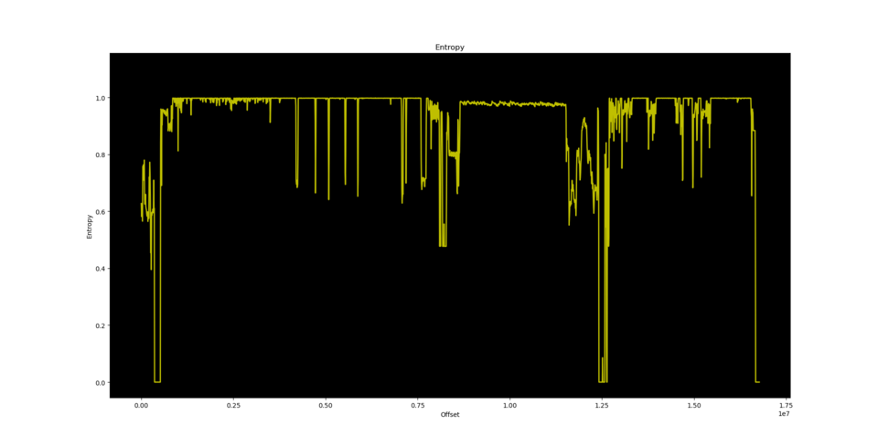

# Reversing the flash dump

The flash dump is analyzed has the following md5

```
716c4263fb7ca44cd3606ab1874c06eb
```

since it's in the ``SPI`` flash and the actual user data is in
the SD card it's assumed that the former remains untouched
and varies only in a new revision.

**Note:** after working for a while on this dump it seems that the datasheet
with the most useful information is the ``ATJ2227x`` one.

## booting process

the boot process: looking at the first 512 bytes of the dump

```
00000000: 0900 0010 0000 0000 1000 0000 0100 0000  ................
00000010: 0100 0000 0301 29b0 0000 0000 0000 0000  ......).........
00000020: 002a 06b4 4cb5 0000 01b0 083c 1c80 0835  .*..L......<...5
00000030: 0100 0924 0000 09ad 06b4 1d3c 007f bd37  ...$.......<...7
00000040: 0002 0424 1000 0524 0228 8570 2328 a400  ...$...$.(.p#(..
00000050: 06b4 063c 002a c624 06b4 1a3c 0004 5a37  ...<.*.$...<..Z7
00000060: 09f8 4003 0200 0824 06b4 043c 002a 8424  ..@....$...<.*.$
00000070: 001e 0524 4a80 010d 0000 0000 0300 4010  ...$J.........@.
00000080: 0000 0000 0b00 0010 0000 0000 06b4 083c  ...............<
00000090: aa55 093c 5a5a 2935 0000 09ad ffff 0834  .U.<ZZ)5.......4
000000a0: 22b0 093c 0800 2935 0000 28ad 808a 010d  "..<..)5..(.....
000000b0: 0000 0000 06b4 1a3c 0004 5a37 09f8 4003  .......<..Z7..@.
000000c0: 0300 0824 06b4 1a3c 0004 5a37 09f8 4003  ...$...<..Z7..@.
000000d0: 0900 0824 c0bf 083c 0800 098d 0b63 0124  ...$...<.....c.$
000000e0: 0200 2111 0050 0a35 0054 0a35 fc1f 0824  ..!..P.5.T.5...$
000000f0: 06b4 0b3c 0060 6b35 2160 0a01 0020 093c  ...<.`k5!`... .<
00000100: 2548 2201 fc1f 69ad 0000 488d 0400 4a25  %H"...i...H...J%
00000110: 0000 68ad fcff 4c15 0400 6b25 04e0 6821  ..h...L...k%..h!
00000120: 0800 0001 0000 0000 2158 8500 feff 6b25  ........!X....k%
00000130: 0000 6d95 feff 6b25 0000 6895 aa55 0a24  ..m...k%..h..U.$
00000140: 0800 0a15 2160 0000 0000 6895 2160 8801  ....!`....h.!`..
00000150: fdff 6415 feff 6b25 ffff 8c31 0200 8d11  ..d...k%...1....
00000160: 0000 0224 0100 0224 0800 e003 0000 0000  ...$...$........
00000170: 0000 0000 0000 0000 0000 0000 0000 0000  ................
00000180: 0000 0000 0000 0000 0000 0000 0000 0000  ................
00000190: 0000 0000 0000 0000 0000 0000 0000 0000  ................
000001a0: 0000 0000 0000 0000 0000 0000 0000 0000  ................
000001b0: 0000 0000 0000 0000 0000 0000 0000 0000  ................
000001c0: 0000 0000 0000 0000 0000 0000 0000 0000  ................
000001d0: 0000 0000 0000 0000 0000 0000 0000 0000  ................
000001e0: 0000 0000 0000 0000 0000 0000 0000 0000  ................
000001f0: 0000 0000 4163 7442 726d aa55 3bb3 86ce  ....ActBrm.U;...
```

(where you note the ``ActBrm`` signature at the end), we have at the start
a jump to offset ``0x28``

```
ram:00000000               09 00 00 10     b                  FUN_00000028
ram:00000004               00 00 00 00     _nop
```

where the real startup happens; ``ghidra`` tries its best to come up
with something useful (below you can see the result after some reworking)

```c
void FUN_00000028(void)

{
  int iVar1;
  undefined4 s;
  dword *start;
  undefined4 *_dst;
  undefined4 *end;
  undefined4 *dst;
  
  _DAT_b001801c = 1;
  (*(code *)0xb4060400)(0x200,0x1e00,0xb4062a00);
  iVar1 = func_0x04060128(0xb4062a00,0x1e00);
  if (iVar1 == 0) {
    uRamb4060000 = 0x55aa5a5a;
    _DAT_b0220008 = 0xffff;
    func_0x04062a00();
  }
  (*(code *)0xb4060400)();
  uRamb4067ffc = (*(code *)0xb4060400)();
  start = (undefined4 *)&DAT_bfc05000;
  if (_DAT_bfc00008 != 0x630b) {
    start = (undefined4 *)&DAT_bfc05400;
  }
  end = start + 0x7ff;
  uRamb4067ffc = uRamb4067ffc | 0x20000000;
  dst = (undefined4 *)0xb4066000;
  do {
    _dst = dst;
    s = *start;
    start = start + 1;
    *_dst = s;
    dst = _dst + 1;
  } while (start != end);
  /* WARNING: Could not recover jumptable at 0x00000120. Too many branches */
  /* WARNING: Treating indirect jump as call */
  (*(code *)(_dst + -0x7fe))();
  return;
}
```

Seeing also the remaining part of the code seems that this code
will be loaded around address ``0xb406xxxx`` but if you use the
``0000`` as the starting address you quickly realize that something
doesn't match up: in particular the function at ``0xb4060400`` that
is in the middle of a well defined function.

With some experimentation around offsets the most plausible address is
``0xb4062a00`` that is the argument passed at the "not-matching-function":
my educated guess is that the function is loading, starting from offset ``0x200``
``0x1e00`` bytes (up to the partitions) at address ``0xb4062a00``, check something and then jump
to that address.

Since at offset ``0x128`` there is a function that is recognizable as a form of ``crc``

```c

int crc(dword *addr,int offset)

{
  bool bVar1;
  dword *ptr;
  short c;
  
  ptr = (dword *)((int)addr + offset + -4);
  c = 0;
  if (*(short *)ptr == 0x55aa) {
    do {
      c = c + *(short *)ptr;
      bVar1 = ptr != addr;
      ptr = (dword *)((int)ptr + -2);
    } while (bVar1);
    if (c == *(short *)((int)addr + offset + -2)) {
      return 0;
    }
  }
  return 1;
}

```

I'm assuming that at very start of the bootup process, the first 512 bytes 
of the flash are loaded at address ``0xb4060000``
with some other routines at address ``0xb4060400`` and then happens what is described above.

**Note:** the stack pointer is set at address ``0xb4067f00``, obviously the decompiler
cannot show that in ``C``.

**TL;DR:** in ``ghidra`` load the flash dump at ``0xb4062800``, probably there exists a
routine that move the flash data at that address and then jump to execute the
function at ``0xb4062a00``.

It's interesting this note in the
[rockbox's wiki](https://www.rockbox.org/wiki/ATJ213xFirmware#Booting_sequence) about the boot sequence
of the ``ATJ213x``:

    On power on the CPU begin execution at VA=0xbfc00000 (PA=0x1fc00000) where BROM
    is mapped. BROM loads MBRCF*.BIN stored at the beginning of nand flash into iram
    (VA=0xb4040000, PA=0x14040000), check signature and checksum and passes control
    to the just loaded code. MBRCF* initializes caches, clocks, DRAM, loads BREC*
    loader to the DRAM (VA=0x80000000, PA=0x00000000) and passes control to the
    BREC. BREC checks logical structure of flash, loads and passes control to uCOS
    kernel. If at any stage of load chain en error is encountered 'Hard DFU' handler
    stored at 0xbfc05400 (0x1ffc bytes) in BROM is copied to 0xb4046800 and CPU
    jumps to this handler.

in particular this last part seems that code after the failing of the ``crc`` check.

### Loading partitions

Now starts the business: it's a little difficult to describe the code so what
follows is a description of some important functions

At offset ``0x1254`` there is a function that reuses the original function
at ``0xb4060400``

```c
void map_sectors(int offset,dword *address,int length)

{
  FUN_b4060400(offset << 9,length << 9,(dword)address);
  return;
}
```

and it seems to use a **sector** as a unit (here it's implied that 512 bytes
is the size of such unit).

This function is used to start mapping the partition descriptions found at the offset ``0x2000``.
Then the checksum is calculated and compared with the value at ``0x23f4``.

Another important function is

```c
int load_partition_type(int type,dword **callback)

{
  dword *address;
  uint checksum;
  int ret;
  uint index;
  uint next_index;
  
  index = 0;
  while( true ) {
    next_index = index + 1;
    if (*(char *)&PARTITION_ADDRESS[index].type == type) break;
    index = next_index;
    if (0x1e < next_index) {
      *callback = NULL;
      return -1;
    }
  }
  map_sectors(PARTITION_ADDRESS[index].offset,&MEM_TMP_START,1);
  address = (dword *)tlb_configure_for_type
                               (type,DWORD_b4064c08,
                                ((MEM_TMP_END - MEM_TMP_START) + 0x203 >> 9) +
                                (PARTITION_ADDRESS[index].size >> 9));
  *callback = address;
  ret = -3;
  if (address != NULL) {
    map_sectors(PARTITION_ADDRESS[index].offset,address,
                PARTITION_ADDRESS[index].size >> 9);
    checksum = checksum_plus((byte *)*callback,PARTITION_ADDRESS[index].size,4);
    if (PARTITION_ADDRESS[index].checksum != checksum) {
      *callback = NULL;
      return -2;
    }
    zero((byte *)MEM_TMP_START,MEM_TMP_END);
    ret = 0;
    *callback = (dword *)MEM_CALLBACK;
  }
  return ret;
}
```

(edited to remove useless parameters); in practice it takes a partition identified
by a specific **type**, it maps it and returns the entry point of the loaded module.

The ``tlb_configure_for_type()`` configures the ``MMU`` and for this level of analysis
it's not important.

At this point the code is loading the module "startup.bin" and after that the module
named "brecf03.bin" with the following array of arguments:

 - the index of the ``TLB``(?)
 - the address where the calling module has been loaded (our ``0xb4062a00``)
 - some hardcoded address, probably read only data
 - some unidentified value
 - the entry point of the "storage.bin" module (mapped just before this)
 - the ``tlb_configure_for_type()`` address

## Partitions

At offset ``0x2000`` we see a block that resembles a partition
following this organization in memory:

```c
struct partition_t {
	char label[12];
	uint32_t type;
	uint32_t _unknown;
	uint32_t block_offset; /* block size of 512 bytes */
	uint32_t size; /* in bytes */
	uint32_t checksum; /* to be confirmed */
};
```

From each section of the partition is possible to extract raw binaries (that we'll call "modules"
in the following) that have
a common "header" (the first four dwords) with information about their loading:

 - upper limit of the memory used
 - max extension of memory needed
 - base address
 - entry point

A couple of them register syscalls using as slot their type identifier

| Label           | Description     | load address   | type |
|-----------------|-----------------|----------------|------|
| ``brecf03.bin`` | boot record ??? | ``0xc3080000`` | 0    |
| ``welcome.bin`` |                 |                | 1    |
| ``card.bin``    | mmc driver      | ``0xc0700000`` | 2    |
| ``storage.bin`` | SPI NOR driver  | ``0xc30a0000`` | 3    |
| ``upg.bin``     | upgrade code    | ``0xc0400000`` | 5    |
| ``lcd.bin``     | lcd driver      | ``0xc0f00000`` | 8    |
| ``startup.bin`` | bootstrap ?     | ``0xb4064e00`` | 9    |
| ``fb.bin``      | framebuffer ??? | ``0xc0200000`` | 0xa  |
| ``shutoff.bin`` | shutoff :)      | `` ``          | 0xc  |
| ``key.bin``     | read keypress   | ``0xc0d00000`` | 0xd  |
| ``mfp.bin``     | multifunction   | ``0xc0280000`` | 0x16 |

This extracted modules are only a little portion of the total content of the
flash, at ``0xb40c0000`` (offset ``0x80000``, 512KB) starts something else.

From the entropy graph generated by ``binwalk``



we can assume that such content is encrypted/compressed.

## ``startup.bin``

It's the first called from the bootloader, it seems to check some configuration
strings and when are found use this to setup GPIOs accordingly.

## ``brecf03.bin``

The most important is the ``brec`` one, it sets a jump table at address
``0xc3080e00`` that is called from the other binaries to perform common service;
take note that the tenth entry is the ``log`` function!

It configures the serial port with the values stored at offset (from the start
of the flash) ``0x1e60`` (baudrate) and ``0x1e64`` (which ``UART`` to use).

**Note:** the function configuring the baudarate via the ``CMU_UART1CLK`` seems
to not enable the ``UART``'s clock itself (i.e. it doesn't set the ``U1EN``
bit).

## ``storage.bin``

It's loaded by ``brec`` and from the code contained into it is possible to
deduce that the memory mapping assigned for the SPI NOR memory starts at ``0xb0258000``.

Moreover also the GPIOs are probably more than the ``A`` and ``B`` set since a couple
of addresses are called from this module.

It seems also using some ``DMA`` transactions; the memory mapping for it starts at ``0xb0220000``
with channel width of 32 bytes.

The important characteristic of this module is that, when requested operations involving sectors
starting from ``0x400`` (i.e. ``0x80000`` bytes) the data is "encoded"

```c
void _decode(byte *buffer,dword *seed,uint offset,short size)

{
  int16_t index3;
  uint32_t seed7;
  uint32_t tmp;
  int16_t index;
  int16_t index2;
  uint32_t key [8];
  uint32_t *_buffer;
  
  key[0] = KEY[0];
  key[1] = KEY[1];
  key[2] = KEY[2];
  key[3] = KEY[3];
  key[4] = KEY[4];
  key[5] = KEY[5];
  key[6] = KEY[6];
  key[7] = KEY[7];
  _buffer = (uint32_t *)buffer;
  if (((uint)buffer & 3) != 0) {
    _buffer = RANDOM_INIT;
    sys_memcpy(RANDOM_INIT,buffer,0x200);
  }
  for (index = 0; index < 8; index = index + 1) {
    key[index] = key[index] ^ 0x5a << (offset & 0x1f) ^ seed[index];
  }
  seed7 = seed[7];
  for (index2 = 0; index2 < size; index2 = index2 + 1) {
    index3 = (int16_t)((int)index2 << 3);
    _buffer[index3] = _buffer[index3] ^ key[1];
    key[0] = key[1];
    _buffer[index3 + 1] = _buffer[index3 + 1] ^ key[2];
    key[1] = key[2];
    _buffer[index3 + 2] = _buffer[index3 + 2] ^ key[3];
    key[2] = key[3];
    tmp = key[3] ^ key[5];
    _buffer[index3 + 3] = _buffer[index3 + 3] ^ key[4];
    key[3] = key[4];
    _buffer[index3 + 4] = _buffer[index3 + 4] ^ key[5];
    key[4] = key[5];
    _buffer[index3 + 5] = _buffer[index3 + 5] ^ key[6];
    key[5] = key[6];
    _buffer[index3 + 6] = _buffer[index3 + 6] ^ key[7];
    key[6] = key[7];
    _buffer[index3 + 7] = _buffer[index3 + 7] ^ tmp;
    key[7] = _buffer[index3 + 7] ^ seed7;
  }
  if (((uint)buffer & 3) != 0) {
    sys_memcpy(buffer,_buffer,0x200);
  }
  return;
}
```

Use [decrypt.c](decrypt.c) to extract such part of the file from the flash dump.

## ``upg.bin``

It looks for ``/mnt/udisk/us227a.upg``, probably the code indicates the specific
version of ``SDK`` used to build the system.

## Second stage partition

The "second stage" partition is different from the one above, as it's easy to
see from this snippet:

```
00000200: 4657 494e 464f 2020 4249 4e00 0000 0000 1000 0000 0002 0000 0002 0000 448d 47c3  FWINFO  BIN.................D.G.
00000220: 4f45 4d4f 2020 2020 4249 4e00 0000 0000 1100 0000 0004 0000 0004 0000 4595 e110  OEMO    BIN.................E...
00000240: 4f45 4d20 2020 2020 4b4f 2000 0000 0000 1300 0000 0020 0000 241f 0000 aa94 429d  OEM     KO .......... ..$.....B.
00000260: 4f45 4d20 2020 2020 534f 2000 0000 0000 2300 0000 001c 0000 781a 0000 86de cd8e  OEM     SO .....#.......x.......
00000280: 5359 5343 4647 2020 5359 5300 0000 0000 3100 0000 008e 0400 c08c 0400 7948 3ab3  SYSCFG  SYS.....1...........yH:.
000002a0: 4653 2020 2020 2020 4b4f 2000 0032 0100 7802 0000 00c0 0000 84bf 0000 67df 350e  FS      KO ..2..x...........g.5.
000002c0: 4d46 5020 2020 2020 4b4f 2000 0032 0000 d802 0000 0022 0000 6020 0000 97d4 e393  MFP     KO ..2......."..` ......
```

It's possible to extract the elements in this partition using [this script](extract_decrypted_partitions.py)
after decrypted it

```
$ ./decrypt spiflash.img > decrypted.bin
$ ./extract_decrypted_partitions.py decrypted.bin
FWINFO  BIN: 0x2000-0x2200
OEMO    BIN: 0x2200-0x2600
OEM     KO : 0x2600-0x4600
OEM     SO : 0x4600-0x6200
SYSCFG  SYS: 0x6200-0x4f000
FS      KO : 0x4f000-0x5b000
MFP     KO : 0x5b000-0x5d200
 ...
GPIO_CFGBIN: 0xb4da00-0xb4dc00
MIN_GPIOBIN: 0xb4dc00-0xb4de00
CONFIG  BIN: 0xb4de00-0xb56c00
OEM     BIN: 0xb56c00-0xb57400
```

use the ``--outdir`` option to dump them.

Some interesting files here are 

 - ``SYSCFG.BIN``: it's the kernel, probably ``u-cos II``
 - ``BOOT_PIC.BIN`` is a (800x480) ``RGB565`` little endian image with a 32bytes header

There are a couple of ``ELF`` files with compressed segments that the
``brecf03.bin`` calls ``ZLF``.

